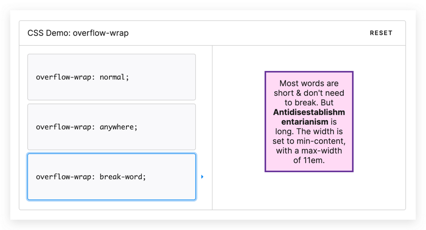

# textwrap
Text wrap algorithms like css ['overflow-wrap: break-word;'](https://developer.mozilla.org/zh-CN/docs/Web/CSS/overflow-wrap)

- Wrap text without breaking words as much as possible
- Support Chinese characters and super long words

## Known problems
- Does not follow the ["Unicode line breaking algorithm"](http://unicode.org/reports/tr14/)